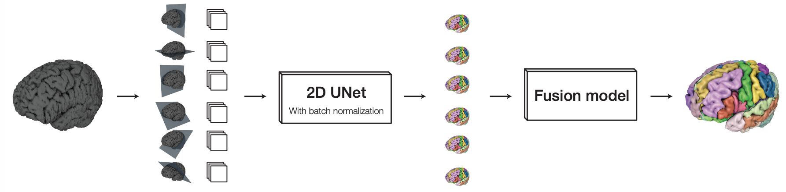
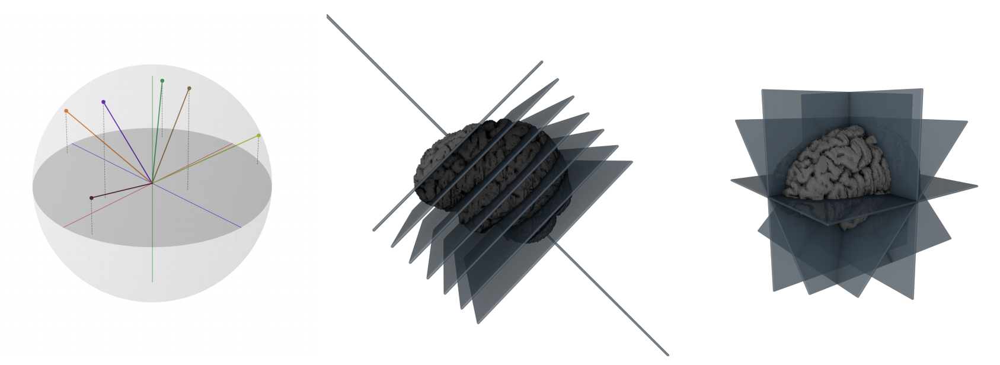

# Multi-Planar U-Net

Implementation of the Multi-Planar U-Net as described in: 

Mathias Perslev, Erik Dam, Akshay Pai, and Christian Igel. One Network To 
Segment Them All: A General, Lightweight System for Accurate 3D Medical Image
Segmentation. In: Medical Image Computing and Computer Assisted Intervention 
(MICCAI), 2019

Pre-print version: [https://arxiv.org/abs/1911.01764](https://arxiv.org/abs/1911.01764)

Published version: [https://doi.org/10.1007/978-3-030-32245-8_4](https://doi.org/10.1007/978-3-030-32245-8_4)#

---

#### Other publications
The Multi-Planar U-Net as implemented here was also used in the following context(s):

* <i>The International Workshop on Osteoarthritis Imaging Knee MRI Segmentation Challenge</i>, described in [https://arxiv.org/abs/2004.14003](https://arxiv.org/abs/2004.14003). Data supporting our team's contribution may be found [here](https://sid.erda.dk/wsgi-bin/ls.py?share_id=d0s7yd7Sgk) (hyperparameter files, parameter files, test-set predictions etc.).

---

## Quick Start
#### Installation

```
# From GitHub
git clone https://github.com/perslev/MultiPlanarUNet
pip install -e MultiPlanarUNet
```

This package is still frequently updated and it is thus recommended to install 
the package with PIP with the -e ('editable') flag so that the package can be 
updated with recent changes on GitHub without re-installing:

```
cd MultiPlanarUNet
git pull
```

However, the package is also occasionally updated on PyPi for install with:

```
# Note: renamed MultiPlanarUNet -> mpunet in versions 0.2.4
pip install mpunet
```

#### Usage
```
usage: mp [script] [script args...]

Multi-Planar UNet (0.1.0)
-------------------------
Available scripts:
- cv_experiment
- cv_split
- init_project
- predict
- predict_3D
- summary
- train
- train_fusion
...
```

## Overview
This package implements fully autonomous deep learning based 
segmentation of any 3D medical image. It uses a fixed 
hyperparameter set and a fixed model topology, eliminating the need for
conducting hyperparameter tuning experiments. No manual involvement is 
required except for supplying the training data.

The system has been evaluated on a wide range of tasks covering various organ and 
pathology segmentation tasks, tissue types, and imaging modalities. 
The model obtained a top-5 position at the 2018 Medical Segmentation Decathlon 
(http://medicaldecathlon.com/) despite its simplicity and computational 
efficiency.

This software may be used as-is and does not require deep learning expertise to
get started. It may also serve as a strong baseline method for general purpose
semantic segmentation of medical images.

## Method
The base model is a slightly modified 2D U-Net (https://arxiv.org/abs/1505.04597) 
trained under a multi-planar framework. Specifically, the 2D model is
fed images sampled across multiple views onto the image volume simultaneously:

[Multi-Planar Animation](resources/multi_planar_training.gif)

At test-time, the model predict along each of the views and recreates a set of full segmentation volumes. 
These volumes are fused into one using a learned function that weights
each class from each view individually to maximise the performance.





## Usage

Project initialization, model training, evaluation, prediction etc. can be 
performed using the scripts located in ```MultiPlanarUNet.bin```. The script 
named ```mp.py``` serves as an entry point to all other scripts, and it is used
as follows:

```bash
# Invoke the help menu
mp --help

# Launch the train script
mp train [arguments passed to 'train'...]

# Invoke the help menu of a sub-script
mp train --help
```

You only need to specify the training data in the format described 
below. Training, evaluation and prediction will be handled automatically if 
using the above scripts.

#### Preparing the data
In order to train a model to solve a specific task, a set of manually 
annotated images must be stored in a folder under the following structure:

```
./data_folder/
|- train/
|--- images/
|------ image1.nii.gz
|------ image5.nii.gz
|--- labels/
|------ image1.nii.gz
|------ image5.nii.gz
|- val/
|--- images/
|--- labels/
|- test/
|--- images/
|--- labels/
|- aug/ <-- OPTIONAL
|--- images/
|--- labels/
```

The names of these folders may be customized in the parameter file (see below), 
but default to those shown above. The image and corresponding label map files 
must be identically named.

The ```aug``` folder may store additional images that can be included during 
training with a lower weight assigned in optimization.

#### File formatting
All images must be stored in the ``.nii``/```.nii.gz``` format. 
It is important that the .nii files store correct 4x4 affines for mapping
voxel coordinates to the scanner space. Specifically, the framework needs to
know the voxel size and axis orientations in order to sample isotrophic images 
in the scanner space.

Images should be arrays of dimension 4 with the first 3 corresponding to the 
image dimensions and the last the channels dimension (e.g. [256, 256, 256, 3] 
for a 256x256x256 image with 3 channels). Label maps should be identically 
shaped in the first 3 dimensions and have a single channel 
(e.g. [256, 256, 256, 1]). The label at a given voxel should be an integer 
representing the class at the given position. The background class is normally 
denoted '0'.

#### Initializing a Project
Once the data is stored under the above folder structure, a Multi-Planar 
project can be initialized as follows:

```
# Initialize a project at 'my_folder'
# The --data_dir flag is optional
mp init_project --name my_project --data_dir ./data_folder
```

This will create a folder at path ```my_project``` and populate it with a YAML
file named ```train_hparams.yaml```, which stores all hyperparameters. Any 
parameter in this file may be specified manually, but can all be set 
automatically.

**NOTE:** By default the ```init_project``` prepares a Multi-Planar model. 
However, note that a 3D model is also supported, which can be selected by 
specifying the ```--model=3D``` flag (default=```---model=MultiPlanar```).

#### Training
The model can now be trained as follows:

```
mp train --num_GPUs=2   # Any number of GPUs (or 0)
```

During training various information and images will be logged automatically to 
the project folder. Typically, after training, the folder will look as follows:

```
./my_project/
|- images/               # Example segmentations through training
|- logs/                 # Various log files
|- model/                # Stores the best model parameters
|- tensorboard/          # TensorBoard graph and metric visualization
|- train_hparams.yaml    # The hyperparameters file
|- views.npz             # An array of the view vectors used
|- views.png             # Visualization of the views used
```

#### Fusion Model Training
When using the MultiPlanar model, a fusion model must  be computed after 
the base model has been trained. This model will learn to map the multiple 
predictions of the base model through each view to one, stronger segmentation
volume:
```
mp train_fusion --num_GPUs=2
```

#### Predict and evaluate
The trained model can now be evaluated on the testing data in 
```data_folder/test``` by invoking:

```
mp predict --num_GPUs=2 --out_dir predictions
```

This will create a folder ```my_project/predictions``` storing the predicted 
images along with dice coefficient performance metrics.

The model can also be used to predict on images stored in the ```predictions``` 
folder but without corresponding label files using the ``--no_eval`` flag or on 
single files as follows:

```
# Predict on all images in 'test' folder without label files
mp predict --no_eval

# Predict on a single image
mp predict -f ./new_image.nii.gz

# Preidct on a single image and do eval against its label file
mp predict -f ./im/new_image.nii.gz -l ./lab/new_image.nii.gz
```

#### Performance Summary
A summary of the performance can be produced by invoking the following command
from inside the ```my_project``` folder or ```predictions``` sub-folder:

```
mp summary

>> [***] SUMMARY REPORT FOR FOLDER [***]
>> ./my_project/predictions/csv/
>> 
>> 
>> Per class:
>> --------------------------------
>>    Mean dice by class  +/- STD    min    max   N
>> 1               0.856    0.060  0.672  0.912  34
>> 2               0.891    0.029  0.827  0.934  34
>> 3               0.888    0.027  0.829  0.930  34
>> 4               0.802    0.164  0.261  0.943  34
>> 5               0.819    0.075  0.552  0.926  34
>> 6               0.863    0.047  0.663  0.917  34
>> 
>> Overall mean: 0.853 +- 0.088
>> --------------------------------
>> 
>> By views:
>> --------------------------------
>> [0.8477811  0.50449719 0.16355361]          0.825
>> [ 0.70659414 -0.35532932  0.6119361 ]       0.819
>> [ 0.11799461 -0.07137918  0.9904455 ]       0.772
>> [ 0.95572575 -0.28795306  0.06059151]       0.827
>> [-0.16704373 -0.96459936  0.20406974]       0.810
>> [-0.72188903  0.68418977  0.10373322]       0.819
>> --------------------------------
```

## Cross Validation Experiments
Cross validation experiments may be easily performed. First, invoke the 
```mp cv_split``` command to split your ```data_folder``` into a number of 
random splits:

```
mp cv_split --data_dir ./data_folder --CV=5
```

Here, we prepare for a 5-CV setup. By default, the above command will create a
folder at ```data_folder/views/5-CV/``` storing in this case 5 folders 
```split0, split1, ..., split5``` each structured like the main data folder 
with sub-folders ```train```, ```val```, ```test``` and ```aug``` (optionally, 
set with the ```--aug_sub_dir``` flag). Inside these sub-folders, images a 
symlinked to their original position to safe storage.

#### Running a CV Experiment
A cross-validation experiment can now be performed. On systems with multiple
GPUs, each fold can be assigned a given number of the total pool of GPUs'. In 
this case, multiple folds will run in parallel and new ones automatically start
when previous folds terminate.

First, we create a new project folder. This time, we do not specify a data 
folder yet:

```
mp init_project --name CV_experiment
```

We also create a file named ```script```, giving the following folder structure:

```
./CV_experiment
|- train_hparams.yaml
|- script
```

The train_hparams.yaml file will serve as a **template** that will be applied 
to all folds. We can set any parameters we want here, or let the framework 
decide on proper parameters for each fold automatically. The **script** file 
details the ```mp``` commands (and optionally various arguments) to execute on 
each fold. For instance, a script file may look like:

```
mp train --no_images  # Do not save example segmentations
mp train_fusion
mp predict --out_dir predictions
```

We can now execute the 5-CV experiment by running:

```
mp cv_experiment --CV_dir=./data_dir/views/5-CV \
                 --out_dir=./splits \
                 --num_GPUs=2
                 --monitor_GPUs_every=600
```

Above, we assign 2 GPUs to each fold. On a system of 8 GPUs, 4 folds will be 
run in parallel. We set ```--monitor_GPUs_every=600``` to scan the system for 
new free GPU resources every 600 seconds (otherwise, only GPUs that we 
initially available will be cycled and new free ones will be ignored).

The ```cv_experiment``` script will create a new project folder for each split 
located at ```--out_dir``` (```CV_experiment/splits``` in this case). For each
fold, each of the commands outlined in the ```script``` file will be launched
one by one inside the respective project folder of the fold, so that the 
predictions are stored in ```CV_experiment/splits/split0/predictions``` for 
fold 0 etc.

Afterwards, we may get a CV summary by invoking:

```
mp summary
```

... from inside the ```CV_experiment/splits``` folder.
