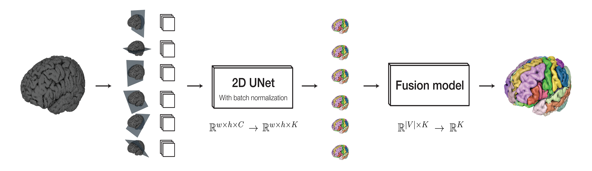

# Multi Planar UNet

This package implements fully autonomous deep learning based 
segmentation of any 3D medical image volume. It uses a fixed 
hyperparameter set and a fixed model topology, eliminating the need for
conducting hyperparameter tuning experiments.

This software may be used as-is and does not require deep learning expertise to
get started. It may also serve as a strong baseline method for general purpose
semantic segmentation of medical images.

The system has been evaluated on a wide range of tasks spanning organ and 
pathology segmentation across tissue types and scanner modalities. 
The model obtained a top-5 position at the 2018 Medical Segmentation Decathlon 
(http://medicaldecathlon.com/) despite its simplicity and computational 
efficiency.

## Method
The base model is a just slightly modified 2D UNet (https://arxiv.org/abs/1505.04597) 
trained under a multi-planar framework. Specifically, the efficient 2D model is
fed images sampled across multiple views onto the image volume simultaneously:

[Multi Planar Animation](resources/multi_planar_training.gif)
[Multi Planar Animation](resources/multi_view.mp4)

At test-time, the model predict along each of the views and recreates a set of full segmentation volumes. 
These volumes are majority voted into one using a learned function that weights
each class from each view individually to maximuse the performance.

The method is described in detail below.
https://1drv.ms/b/s!AhgI3jIn2dNrhcp8yLYv0_EsC97u9A

## Usage
